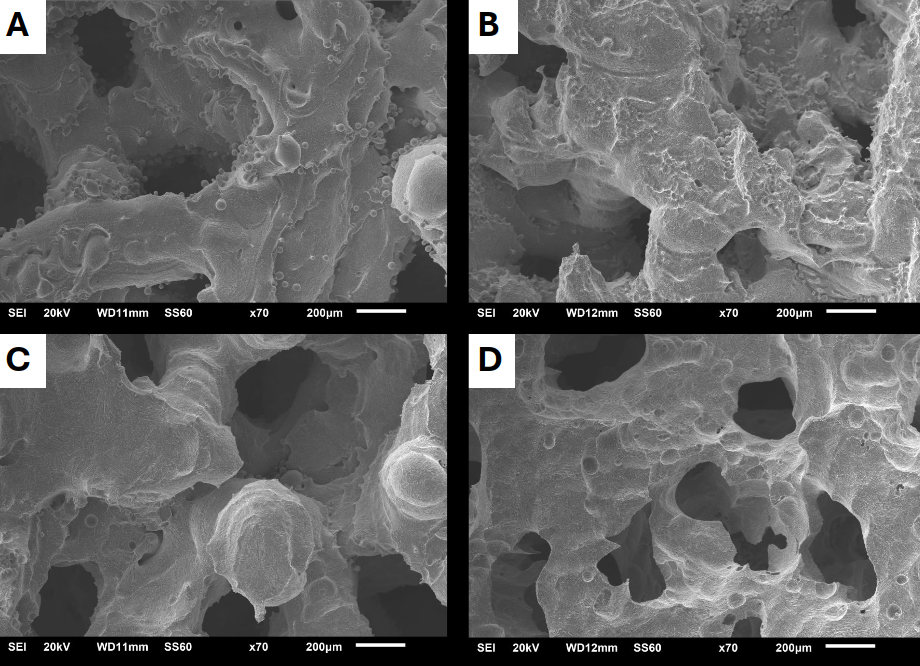
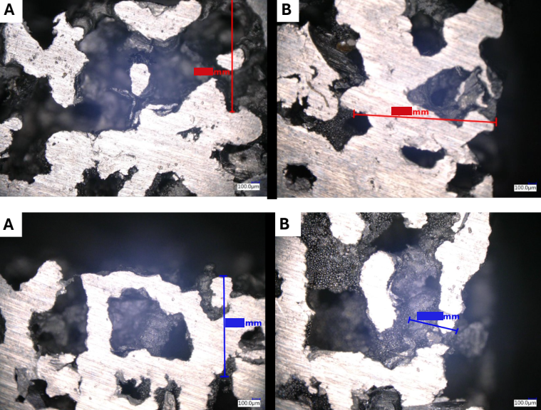

<h1>Postprocessing 3D Titanium Printouts</h1>


<h2>Description</h2>
My bachelor’s thesis, done at TUL, investigated chemical etching (CE) as a post-processing method for 3D-printed titanium parts produced via SLM. This method not only allows for the creation of adjustable shapes for bone implants but also enables the modification of porosity and internal structure to better mimic the properties of host tissue. However, during manufacturing, loose particles can adhere to the material’s surface, making the implant potentially hazardous for a patient. Luckly, this risk can be minimized by etching the object in strong acid, which was the my main objective. 
<br />


<h2>Materials</h2>

- <b>10x10x10mm Cubic samples - printed with Titanium alloy</b>
- <b>Hydrofluoric Acid of X%, Y% and Z%</b>
- <b>Isopropanol</b>

<h2>Equipment used</h2>

- <b>Beakers</b>
- <b>Digital Microscope</b> 
- <b>Ultrasound cleaner</b> 
- <b>Moisture balance</b> 
- <b>Servohydraulic Axial - Torsional Test System</b>

<h2>Results:</h2>

<br/>
<p align="center">

<p align="center">
Figure 1: Samples in the same X% concentration but processed for different times.
<br />

<br/>
<p align="center">

<p align="center">
Figure 2: Samples in the same X% concentration but processed for different times.
<br />

<br/>
<p align="center">

<p align="center">
Figure 3: Samples in the same X% concentration but processed for different times.
<br />

<br/>
<p align="center">

<p align="center">
Figure 4: Samples in the same X% concentration but processed for different times.
<br />


<!--
 ```diff
- text in red
+ text in green
! text in orange
# text in gray
@@ text in purple (and bold)@@
```
--!>
